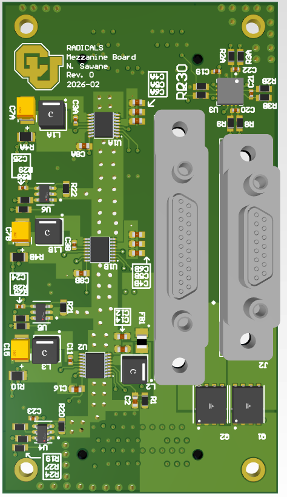
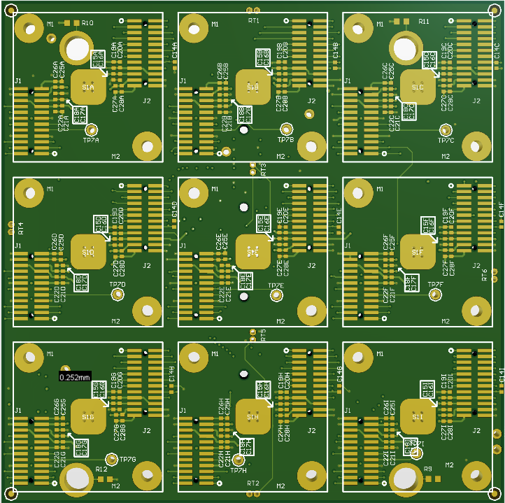

# My Board Designs — PCB Portfolio

A curated collection of my PCB design work, including multi-layer power systems, system carrier boards, mezzanine architectures, sensor/telemetry subsystems, and switching-noise analysis boards.

All content is anonymized and provided solely as a demonstration of **engineering capability, PCB craftsmanship, and documentation standard**.

---

# 🌐 Repository Overview

This repository contains two categories of designs:

### **📁 Professional / Lab Hardware**
Production-style boards designed for power delivery, monitoring, signal routing, and system integration.

- 4-layer multi-rail power module  
- 6-layer power & housekeeping mezzanine board  
- 10-layer detector carrier board  

### **📘 Academic Coursework — ECEN 5730**
PCB design projects completed for **ECEN 5730: PCB Design** at CU Boulder, ranging from introductory layouts to advanced multi-layer mixed-signal systems.

Each project includes:

- Schematics  
- PCB layouts  
- 3D renders  
- Routing analysis  
- Layer stack-ups  
- Documentation + bring-up notes  

---

# 🖼️ Portfolio Gallery

## **⚡ Power Board (4-Layer)**  
A multi-rail switching + LDO power module with clean power distribution, tight switching loops, and controlled-plane design.

**Folder:** [`designs/power-board_4layer`](designs/power-board_4layer)

  

---

## **🧩 Mezzanine Board (6-Layer Power & Housekeeping)**  
A system mezzanine board providing regulated power rails, current monitoring, temperature sensing, and debug access between a carrier board and downstream electronics.

Demonstrates:
- multi-rail DC-DC conversion (12 V → 5 V / 3.3 V / 1.2 V)  
- converter-centric placement and loop control  
- I²C-based housekeeping telemetry  
- mixed power + measurement layout discipline  

**Folder:** [`designs/RADICALS_Mezzanine_Board`](designs/RADICALS_Mezzanine_Board)

  

---

## **🧱 Carrier Board (10-Layer Detector Carrier)**  
A high-density system carrier board used to distribute power, clocks, configuration, and data across a tiled array of identical detector modules.

Demonstrates:
- deep multi-layer stack planning  
- repeated-channel layout symmetry  
- daisy-chained system buses  
- disciplined internal-layer routing  

**Folder:** [`designs/RADICALS_Carrier_Board`](designs/RADICALS_Carrier_Board)

  

---

# 🎓 ECEN 5730 — Coursework Boards

## **1️⃣ Board 1: 555 Timer Board (2-Layer)**  
Foundational PCB introducing RC timing, routing basics, signal flow, and organized schematic hierarchy.

**Folder:** [`designs/ECEN5730/board_1_555_timer`](designs/ECEN5730/board_1_555_timer)

  

---

## **2️⃣ Board 2: Switching Noise — Good vs Bad Layout**  
Side-by-side logic inverter circuits laid out properly vs incorrectly, demonstrating the impact of:

- loop area  
- decoupling  
- PDN design  
- return paths  
- ringing & switching noise  

**Folder:** [`designs/ECEN5730/board_2_switching_noise_with_good_and_bad_layout`](designs/ECEN5730/board_2_switching_noise_with_good_and_bad_layout)

  

---

## **3️⃣ Board 3: Golden Arduino PCB (2-Layer)**  
A complete microcontroller platform designed from scratch with USB, clocking, power regulation, and standard interfaces.

**Folder:** [`designs/ECEN5730/board_3_golden_arduino_pcb`](designs/ECEN5730/board_3_golden_arduino_pcb)

  

---

## **4️⃣ Board 4: Instrumentation Droid (4-Layer)**  
A mixed-signal instrumentation PCB featuring DACs, displays, LEDs, test points, and dense probing access.

**Folder:** [`designs/ECEN5730/board_4_instrumentation_droid`](designs/ECEN5730/board_4_instrumentation_droid)

  

---

# 🏷️ Skills Demonstrated

### **PCB Engineering**
- 2L / 4L / 6L / 10L stack-up planning  
- Switching regulator layout & current-loop control  
- Ground & power plane design  
- Mixed-signal routing discipline  
- Telemetry-aware layout (current + temperature sensing)  
- Repeated-channel and tiled architectures  
- High-density connector fanout  
- Test-point and bring-up friendly design  

### **Schematic Design**
- Hierarchical multi-board architectures  
- Power tree design  
- Monitoring & housekeeping subsystems  
- Protection and filtering networks  
- Clear net naming & interconnect definition  

### **System Integration**
- Carrier + mezzanine board partitioning  
- Debug & lab-access planning  
- Sensor & instrumentation integration  
- Mixed analog/digital separation  
- Documentation-first design workflow  

---

# 🖥️ Tools Used

| Tool | Purpose |
|------|---------|
| **Altium Designer** | Schematic, PCB, 3D |
| **Oscilloscope / Lab Tools** | Validation & bring-up |
| **Python / MATLAB** | Supporting analysis |
| **GitHub** | Documentation & version control |

---

# 🏅 Portfolio Badges

  
  
  
  
  

---

# 📬 Contact

If you're reviewing this as part of my engineering portfolio, feel free to connect via LinkedIn:  
**https://www.linkedin.com/in/nikhil-kishor-sawane-b7b52478/**

---

🔒 **Confidentiality Notice**

All project names, customer identifiers, and proprietary information have been removed.  
Only layout strategy, engineering quality, and design execution are shown for demonstration purposes.
