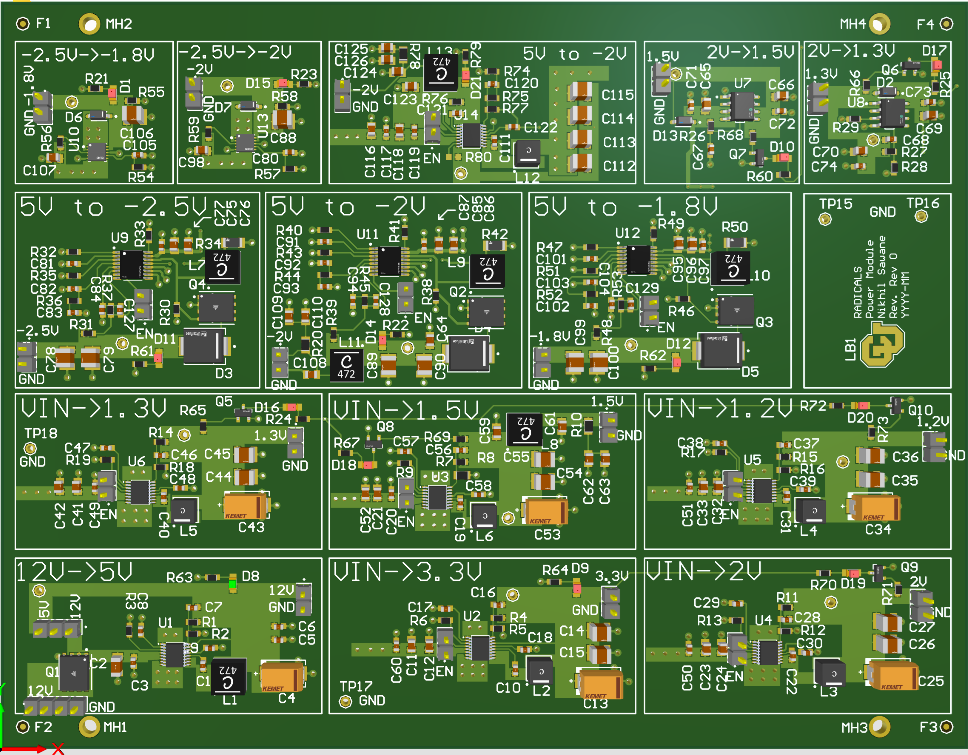
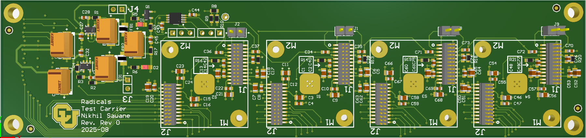
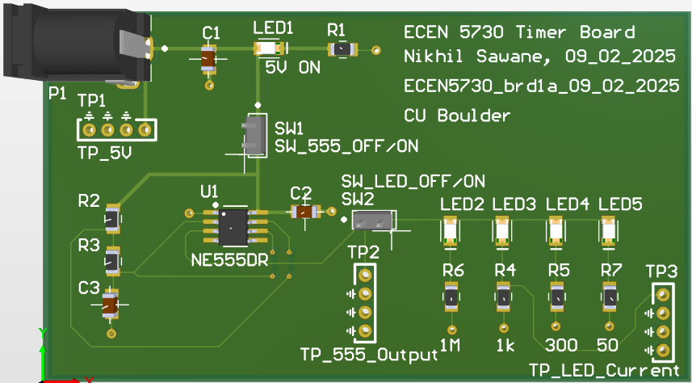
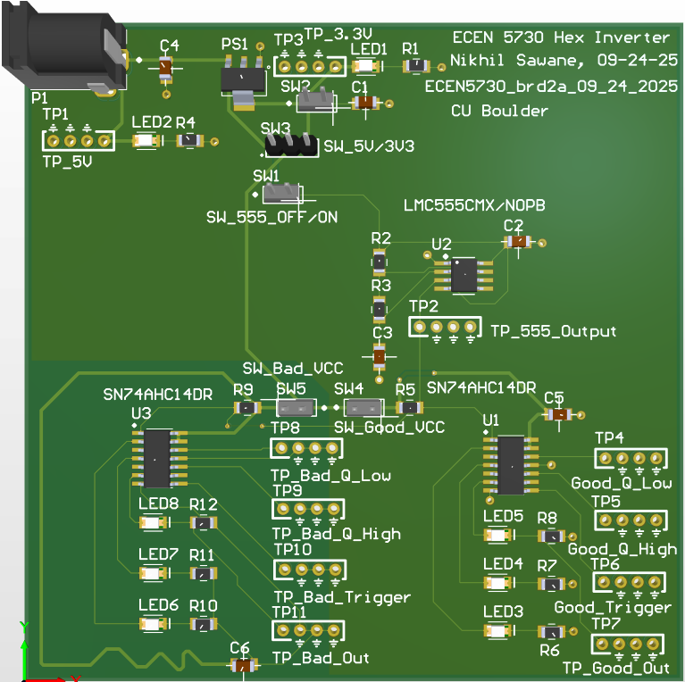
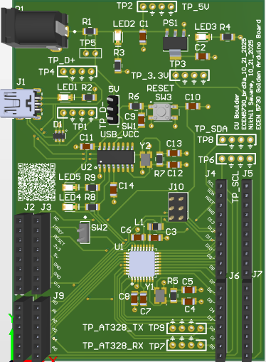
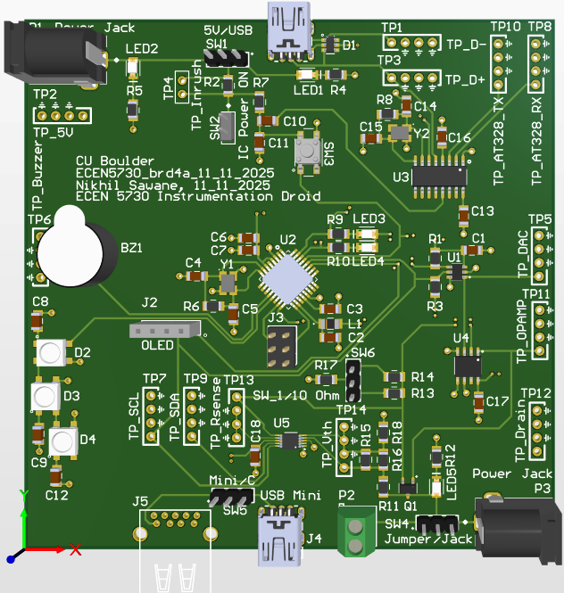

# My Board Designs — PCB Portfolio

A curated collection of my PCB design work, including multi-layer power systems, test/characterization carrier boards, microcontroller platforms, sensor/instrumentation circuitry, and switching-noise analysis boards.

All content is anonymized and provided solely as a demonstration of **engineering capability, PCB craftsmanship, and documentation standard**.

---

# 🌐 Repository Overview

This repository contains two categories of designs:

### **📁 Professional / Lab Hardware**
Production-style boards designed for power delivery, signal routing, and device characterization.

- 4-layer multi-rail power module  
- Multi-module test & characterization carrier board  

### **📘 Academic Coursework — ECEN 5730**
Four PCB design projects completed for **ECEN 5730: PCB Design** at CU Boulder, ranging from beginner to advanced multi-layer mixed-signal systems.

Each project includes:

- Schematics  
- PCB layouts  
- 3D renders  
- Routing analysis  
- Layer stack-ups  
- Documentation + bring-up notes  

---

# 🖼️ Portfolio Gallery

## **🔌 Power Board (4-Layer)**  
A multi-rail switching + LDO power module with clean power distribution, tight switching loops, and controlled-plane design.

**Folder:** [`designs/power-board_4layer`](designs/power-board_4layer)

<p align="center">
  
</p>

---

## **🔧 Test / Characterization Carrier Board**  
A multi-module carrier for device testing and signal breakout. Demonstrates repeated-channel routing, connector alignment, and organized lab-friendly layout.

**Folder:** [`designs/test-carrier_board`](designs/test-carrier_board)

<p align="center">
  
</p>

---

# 🎓 ECEN 5730 — Coursework Boards

## **1️⃣ Board 1: 555 Timer Board (2-Layer)**  
Foundational PCB introducing RC timing, routing basics, signal flow, and organized schematic hierarchy.

**Folder:** [`designs/ECEN5730/board_1_555_timer`](designs/ECEN5730/board_1_555_timer)

<p align="center">
  
</p>

---

## **2️⃣ Board 2: Switching Noise — Good vs Bad Layout**  
Side-by-side logic inverter circuits laid out properly vs incorrectly, demonstrating the impact of:

- loop area  
- decoupling  
- PDN design  
- return paths  
- ringing & switching noise  

**Folder:** [`designs/ECEN5730/board_2_switching_noise_with_good_and_bad_layout`](designs/ECEN5730/board_2_switching_noise_with_good_and_bad_layout)

<p align="center">
  
</p>

---

## **3️⃣ Board 3: Golden Arduino PCB (2-Layer)**  
A complete microcontroller platform designed from scratch:

- ATmega328P core  
- CH340 USB-UART  
- UART / I²C / ICSP  
- 16 MHz + 12 MHz oscillators  
- ESD protection  
- Power regulation  

**Folder:** [`designs/ECEN5730/board_3_golden_arduino_pcb`](designs/ECEN5730/board_3_golden_arduino_pcb)

<p align="center">
  
</p>

---

## **4️⃣ Board 4: Instrumentation Droid (4-Layer)**  
A mixed-signal instrumentation-oriented PCB featuring:

- ATmega328P core  
- DAC subsystem  
- Smart RGB LEDs  
- Buzzer driver  
- OLED connector  
- USB-UART  
- Dense test-point instrumentation  
- Signal → GND → GND → Signal stack  

**Folder:** [`designs/ECEN5730/board_4_instrumentation_droid`](designs/ECEN5730/board_4_instrumentation_droid)

<p align="center">
  
</p>

---

# 🏷️ Skills Demonstrated

### **PCB Engineering**
- 2-layer & 4-layer stack planning  
- Mixed-signal routing (USB, DAC, MCU, LEDs)  
- Switching converter layout + LDO filtering  
- Ground/power plane design & stitching  
- Decoupling strategy and PDN integrity  
- Return-path / SI / edge-rate considerations  
- Repeated-channel layout techniques  
- Test point + probe-friendly design  

### **Schematic Design**
- Clean hierarchical structure  
- Power tree architecture  
- MCU subsystem design (clocking, reset, interfaces)  
- Protection & filtering networks  
- Interconnect definition & labeling  

### **System Integration**
- USB interfaces + ESD protection  
- Sensor & OLED interfacing  
- Microcontroller firmware-ready pinouts  
- Mixed analog-digital separation  
- Lab bring-up workflow  

---

# 🖥️ Tools Used

| Tool | Purpose |
|------|---------|
| **Altium Designer** | Schematic + Layout + 3D |
| **Oscilloscope / Lab Tools** | Verification |
| **Python / MATLAB** | Supplementary automation |
| **GitHub** | Documentation + Version Control |

---

# 🏅 Portfolio Badges

<p align="left">
  
  
  
  
  
</p>

---

# 📬 Contact

If you're reviewing this as part of my engineering portfolio, feel free to connect via LinkedIn:  
**https://www.linkedin.com/in/nikhil-kishor-sawane-b7b52478/**

---

# 📁 Repository Structure

```yaml
my_board_designs/
│
├── designs/
│   ├── power-board_4layer/
│   ├── test-carrier_board/
│   └── ECEN5730/
│       ├── board_1_555_timer/
│       ├── board_2_switching_noise_with_good_and_bad_layout/
│       ├── board_3_golden_arduino_pcb/
│       └── board_4_instrumentation_droid/
│
├── reference-circuits/
└── docs/
```

🔒 Confidentiality Notice

All project names, customer identifiers, and proprietary information have been removed.
Only layout strategy, engineering quality, and design execution are shown for demonstration purposes.


---
