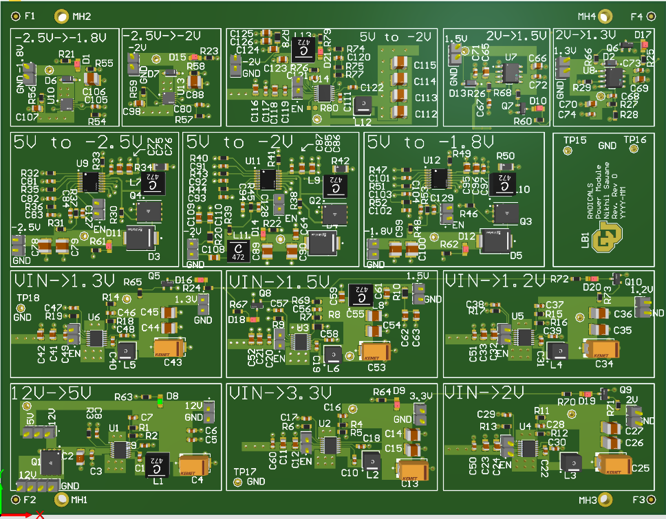
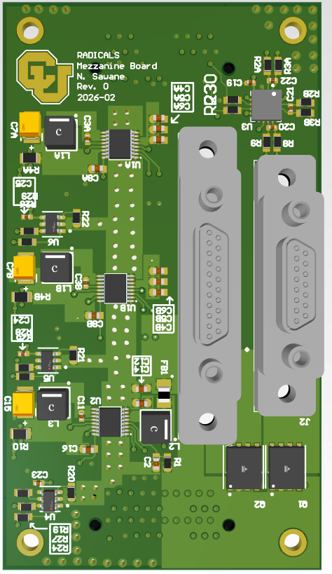
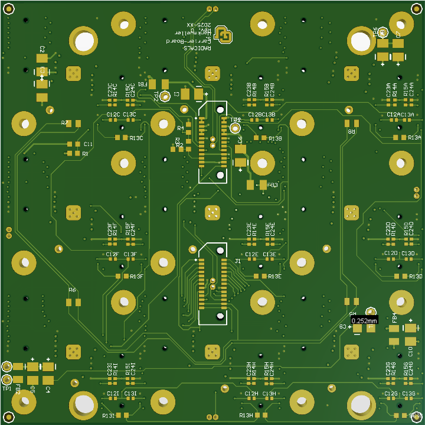
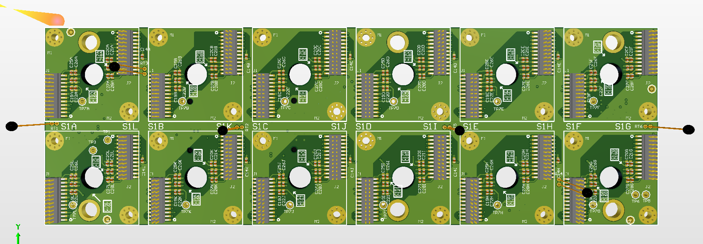
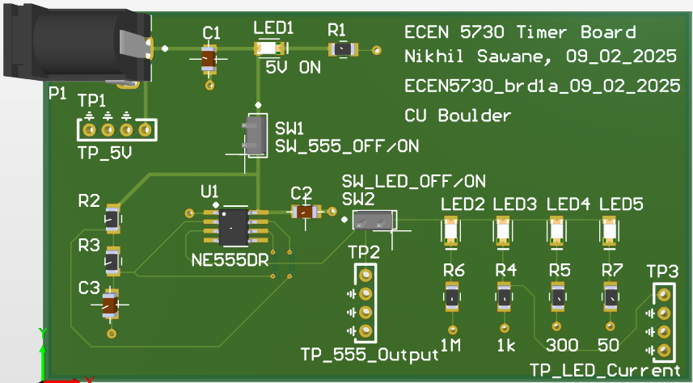
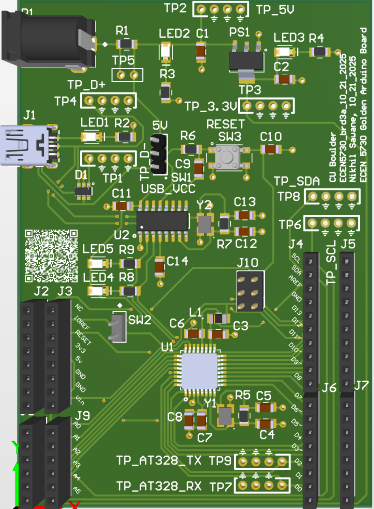
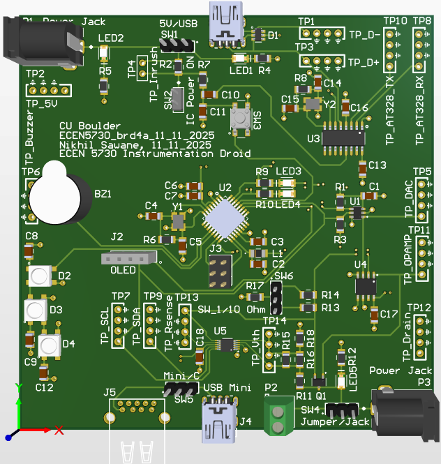

# My Board Designs — PCB Portfolio

A curated collection of my PCB design work, including multi-layer power systems, detector carrier boards, digital interface boards, mezzanine architectures, sensor/telemetry subsystems, and switching-noise analysis boards.

All content is anonymized and provided solely as a demonstration of **engineering capability, PCB craftsmanship, layout discipline, and documentation standard**.

---

# 🌐 Repository Overview

This repository contains two categories of designs:

### **📁 Professional / Lab Hardware**

Production-style boards designed for power delivery, detector interfacing, digital signal routing, housekeeping telemetry, monitoring, and system integration.

- 4-layer multi-rail power module  
- 6-layer power & housekeeping mezzanine board  
- 10-layer detector carrier board  
- 10-layer IMPAX digital interface board  
- 10-layer IMPAX detector carrier board  

### **📘 Academic Coursework — ECEN 5730**

PCB design projects completed for **ECEN 5730: PCB Design** at CU Boulder, ranging from introductory layouts to advanced multi-layer mixed-signal systems.

Each project includes:

- Schematics  
- PCB layouts  
- 3D renders  
- Routing analysis  
- Layer stack-ups  
- Documentation and bring-up notes  

---

# 🖼️ Portfolio Gallery

## **⚡ Power Board (4-Layer)**

A multi-rail switching + LDO power module with clean power distribution, tight switching loops, and controlled-plane design.

Demonstrates:

- 4-layer PCB stack-up planning  
- Multi-rail power generation  
- Buck converter placement and loop control  
- Power and ground plane organization  
- Bring-up focused documentation  

**Folder:** [`designs/power-board_4layer`](designs/power-board_4layer)

<p align="center">
  
</p>

---

## **🧩 RADICALS Mezzanine Board (6-Layer Power & Housekeeping)**

A system mezzanine board providing regulated power rails, current monitoring, temperature sensing, and debug access between a carrier board and downstream electronics.

Demonstrates:

- Multi-rail DC-DC conversion  
- 12 V input conversion to 5 V, 3.3 V, and 1.2 V rails  
- Converter-centric placement and current-loop control  
- I²C-based housekeeping telemetry  
- Current and temperature monitoring  
- Mixed power + measurement layout discipline  

**Folder:** [`designs/RADICALS_Mezzanine_Board`](designs/RADICALS_Mezzanine_Board)

<p align="center">
  
</p>

---

## **🧱 RADICALS Carrier Board (10-Layer Detector Carrier)**

A high-density system carrier board used to distribute power, clocks, configuration, and data across a tiled array of identical detector modules.

Demonstrates:

- 10-layer PCB stack-up planning  
- Repeated-channel layout symmetry  
- Daisy-chained system buses  
- Dense detector interface routing  
- Disciplined internal-layer routing  
- Connector-driven system integration  

**Folder:** [`designs/RADICALS_Carrier_Board`](designs/RADICALS_Carrier_Board)

<p align="center">
  
</p>

---

## **🛰️ IMPAX Digital Board (10-Layer Payload Digital Interface Board)**

A 10-layer digital electronics board developed for the IMPAX payload electronics stack. The board supports digital communication, signal conversion, housekeeping interfaces, calibration routing, and carrier-board connectivity.

Demonstrates:

- 10-layer payload digital PCB architecture  
- MCU-centered digital control structure  
- RS-422, SCI, JTAG, and MCU I/O signal organization  
- Signal conversion between digital-board and carrier-board domains  
- Housekeeping, voltage enable, and monitoring interfaces  
- Ground-referenced routing for dense digital interconnects  

**Folder:** [`designs/IMPAX_Digital_Board`](designs/IMPAX_Digital_Board)

<p align="center">
  
</p>

---

## **🔬 IMPAX Carrier Board (10-Layer Detector Carrier Board)**

A 10-layer detector carrier board developed for the IMPAX payload electronics stack. The board organizes repeated detector interface cells, shared buses, calibration lines, register configuration routing, heater interfaces, and temperature-monitoring connections.

Demonstrates:

- 10-layer detector carrier architecture  
- Repeated detector-cell layout strategy  
- Shared event bus and I/O bus routing  
- Daisy-chained register configuration  
- Internal and external NTC temperature sensing  
- Heater-control and heater-power routing  
- Separate analog and digital power distribution layers  

**Folder:** [`designs/IMPAX_Carrier_Board`](designs/IMPAX_Carrier_Board)

<p align="center">
  
</p>

---

# 🎓 ECEN 5730 — Coursework Boards

## **1️⃣ Board 1: 555 Timer Board (2-Layer)**

Foundational PCB introducing RC timing, routing basics, signal flow, and organized schematic hierarchy.

**Folder:** [`designs/ECEN5730/board_1_555_timer`](designs/ECEN5730/board_1_555_timer)

<p align="center">
  
</p>

---

## **2️⃣ Board 2: Switching Noise — Good vs Bad Layout**

Side-by-side logic inverter circuits laid out properly versus incorrectly, demonstrating the impact of layout quality on switching behavior.

Demonstrates:

- Loop area control  
- Decoupling placement  
- PDN design  
- Return-path awareness  
- Ringing and switching noise behavior  
- Good-layout versus bad-layout comparison  

**Folder:** [`designs/ECEN5730/board_2_switching_noise_with_good_and_bad_layout`](designs/ECEN5730/board_2_switching_noise_with_good_and_bad_layout)

<p align="center">
  
</p>

---

## **3️⃣ Board 3: Golden Arduino PCB (2-Layer)**

A complete microcontroller platform designed from scratch with USB, clocking, power regulation, and standard interfaces.

Demonstrates:

- Microcontroller schematic design  
- USB interface routing  
- Clock and reset circuitry  
- 2-layer routing discipline  
- Power regulation and connector planning  

**Folder:** [`designs/ECEN5730/board_3_golden_arduino_pcb`](designs/ECEN5730/board_3_golden_arduino_pcb)

<p align="center">
  
</p>

---

## **4️⃣ Board 4: Instrumentation Droid (4-Layer)**

A mixed-signal instrumentation PCB featuring DACs, displays, LEDs, test points, and dense probing access.

Demonstrates:

- 4-layer mixed-signal PCB layout  
- DAC and digital interface integration  
- Display and LED circuitry  
- Test-point planning  
- Debug-friendly layout structure  

**Folder:** [`designs/ECEN5730/board_4_instrumentation_droid`](designs/ECEN5730/board_4_instrumentation_droid)

<p align="center">
  
</p>

---

# 🏷️ Skills Demonstrated

### **PCB Engineering**

- 2-layer, 4-layer, 6-layer, and 10-layer stack-up planning  
- Switching regulator layout and current-loop control  
- Ground and power plane design  
- Mixed-signal routing discipline  
- Digital interface routing  
- Telemetry-aware layout with current and temperature sensing  
- Repeated-channel and tiled detector architectures  
- High-density connector fanout  
- Test-point and bring-up friendly design  

### **Schematic Design**

- Hierarchical multi-board architectures  
- Power tree design  
- MCU-centered digital control architecture  
- Detector interface organization  
- Monitoring and housekeeping subsystems  
- Protection and filtering networks  
- Clear net naming and interconnect definition  
- Connector-focused schematic documentation  

### **System Integration**

- Carrier and mezzanine board partitioning  
- Digital-board to carrier-board interface planning  
- Detector array interface routing  
- Debug and lab-access planning  
- Sensor and instrumentation integration  
- Mixed analog/digital separation  
- Documentation-first design workflow  

### **Signal Integrity / Power Integrity**

- Dedicated ground reference planes  
- Controlled return-path planning  
- Dense signal routing across internal layers  
- Clock, bus, and configuration signal organization  
- Power-domain separation  
- Via transitions and stitching strategy  
- Connector fanout and routing symmetry  

---

# 🖥️ Tools Used

| Tool | Purpose |
|------|---------|
| **Altium Designer** | Schematic capture, PCB layout, stack-up planning, 3D visualization |
| **Oscilloscope / Lab Tools** | Validation and bring-up |
| **Python / MATLAB** | Supporting analysis and documentation workflows |
| **GitHub** | Portfolio documentation and version control |
| **VS Code** | Repository editing and Markdown documentation |

---

# 🏅 Portfolio Badges

<p align="left">
  
  
  
  
  
  
</p>

---

# 📁 Repository Structure

```text
my_board_designs/
├─ README.md
├─ designs/
│  ├─ power-board_4layer/
│  ├─ RADICALS_Mezzanine_Board/
│  ├─ RADICALS_Carrier_Board/
│  ├─ IMPAX_Digital_Board/
│  ├─ IMPAX_Carrier_Board/
│  └─ ECEN5730/
│     ├─ board_1_555_timer/
│     ├─ board_2_switching_noise_with_good_and_bad_layout/
│     ├─ board_3_golden_arduino_pcb/
│     └─ board_4_instrumentation_droid/
├─ docs/
└─ images/
```

---

# 📬 Contact

If you're reviewing this as part of my engineering portfolio, feel free to connect via LinkedIn:

https://www.linkedin.com/in/nikhil-kishor-sawane-b7b52478/

---

# 🔒 Confidentiality Notice

All project names, customer identifiers, restricted design details, and proprietary information have been removed where required.

Only layout strategy, engineering quality, documentation structure, and design execution are shown for demonstration purposes.

---
