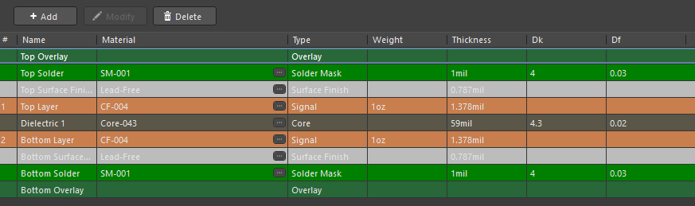
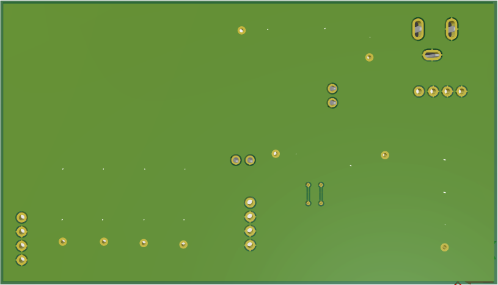
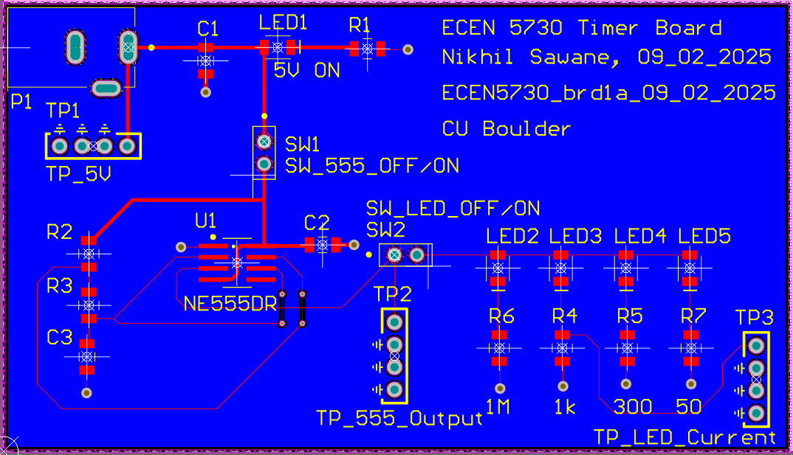
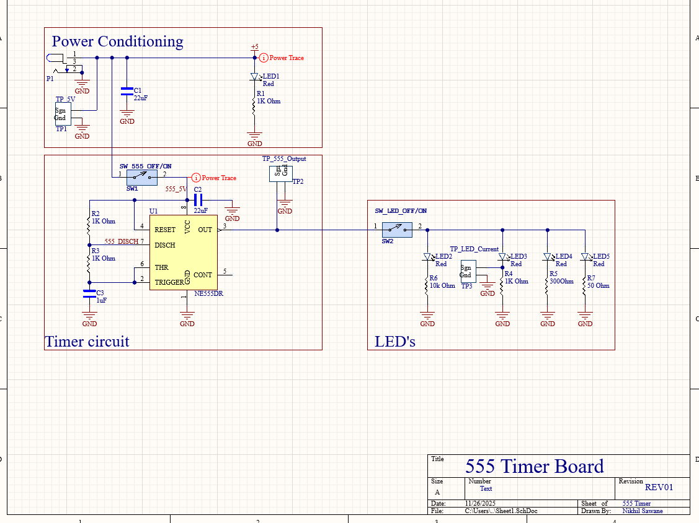

# Board 1 — 555 Timer Circuit (ECEN 5730)

This project implements a classic **NE555 timer** along with a selectable LED-load demonstration circuit.  
Designed as part of the **ECEN 5730 PCB Design** coursework at the University of Colorado Boulder, this board focuses on:

- Clean schematic hierarchy  
- Introductory analog layout  
- Single-sided routing discipline  
- Test-point accessibility  
- Documentation consistency  

It demonstrates practical PCB basics with professional clarity.

---

## 🔍 Overview

### **Functional Blocks**
- **Power Conditioning**  
  - 5 V input  
  - onboard LED indicator  
  - labeled test points  

- **Timer Circuit (NE555DR)**  
  - Astable/monostable configuration  
  - User-controlled enable switch  
  - Dedicated output test point  

- **LED Load Section**  
  - 4 LEDs with resistor options ranging from **1 MΩ → 50 Ω**  
  - Independent LED ON/OFF switch  
  - Current measurement test point  

### **Board Specifications**
- **2-Layer PCB**  
- **1 oz copper**  
- **1 mil solder mask**  
- TH + SMD mixed design  
- Bench-test-optimized layout  

---

# 🖼️ Image Gallery

## **1. Layer Stack**
Two-layer stack-up used for this board.



---

## **2. 3D View — Top Side**
Shows component placement, labeling, test points, and switches.


---

## **3. 3D View — Bottom Side**
Bottom view showing vias, mechanical clearances, and copper distribution.



---

## **4. Top Layer Routing**
Clean and simple routing layout with clear signal flow, symmetry, and well-defined test points.



---

## **5. Schematic (PDF version included)**



A full-resolution schematic is available here:

📄 **[`schematic.pdf`](schematic.pdf)**

---

## 📂 Design Files

This folder includes the complete design artifacts for the 555 timer board.

```yaml
board_1_555_timer/
├── README.md
├── schematic.pdf
├── layout_files/
│ └── 555_timer.zip (Altium layout source files)
└── images/
├── schematic.png
├── layout_top.png
├── layout_3d.png
├── layout_3d_bottom.png
└── layer_stack.png
```

---

## 🎯 Skills Demonstrated

- NE555 analog timing circuit layout  
- Introductory 2-layer routing practices  
- Test-point planning for lab debugging  
- Power routing for small analog circuits  
- Separation of functional blocks on schematic  
- Good silkscreen usage for usability  
- Basic return-path awareness  

---

## 📝 Notes

This board was tested in-lab to measure:

- 555 output timing behavior  
- LED currents across varying resistances  
- Impact of switch configuration on waveform shape  
- Basic noise characteristics and layout stability  

---

This design forms **Board 1** of the full **ECEN 5730 PCB Portfolio**, demonstrating foundational PCB engineering skills.

