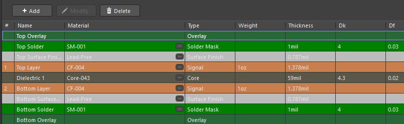
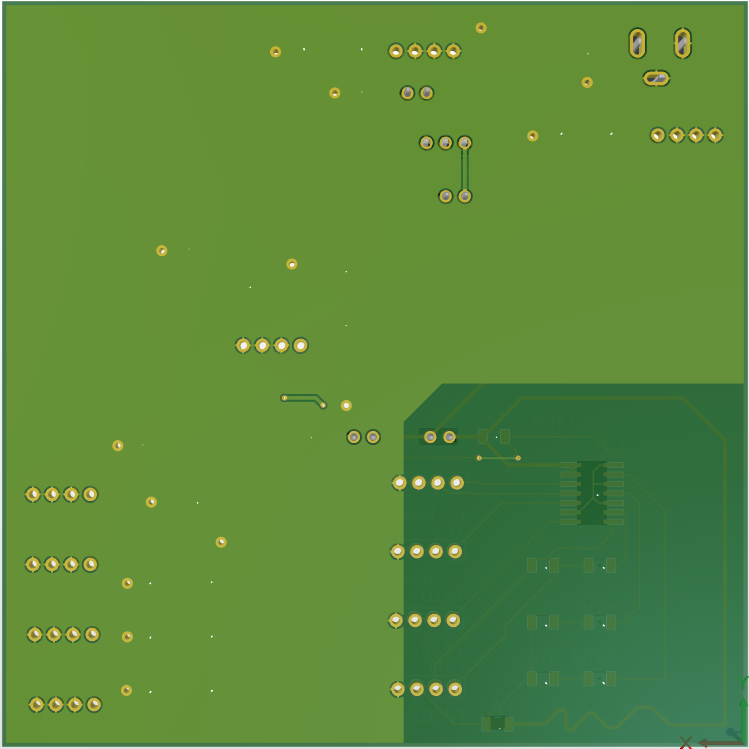
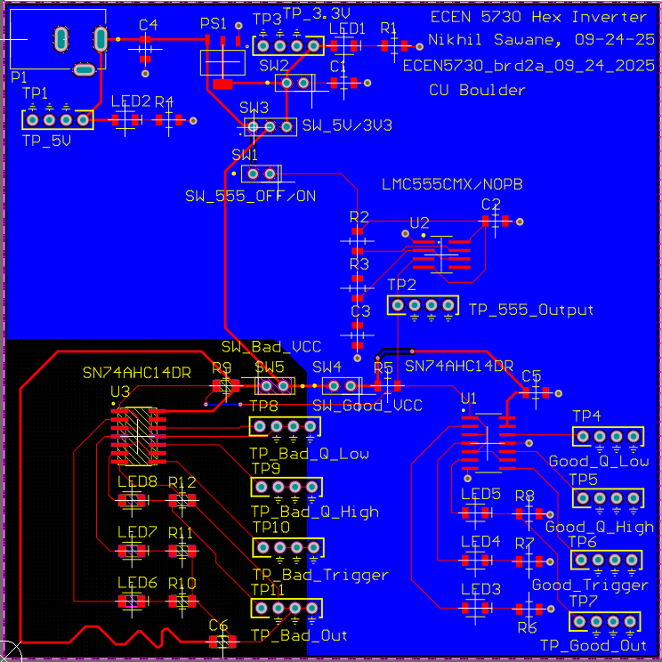
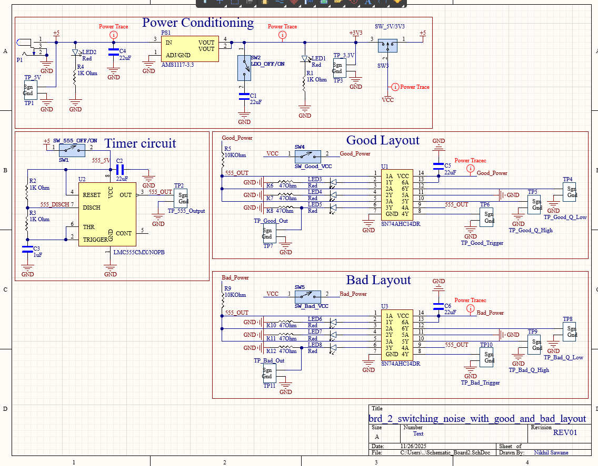

# Board 2 — Switching Noise: Good vs. Bad Layout (ECEN 5730)

This project demonstrates how **PCB layout quality directly affects switching noise, signal integrity, and output waveform stability**.  
The design includes two versions of the same hex inverter circuit:

- **Good Layout** → Proper grounding, tight loop areas, short return paths  
- **Bad Layout** → Long loops, poor decoupling, and parasitic inductance issues  

This board visually and electrically illustrates why switching regulators and logic circuits require disciplined layout practices.

Designed as part of **ECEN 5730 (CU Boulder)**.

---

## 🔍 Overview

### Functional Blocks

- **Power Conditioning** (5 V → 3.3 V LDO, LED indicator)  
- **555 Timer Section** (LMC555)  
- **Good Layout Hex Inverter Section**  
  - Short, tight routing  
  - Local decoupling  
  - Clean return path  
- **Bad Layout Hex Inverter Section**  
  - Long power traces  
  - Poor grounding  
  - Large switching loops  
  - Minimal decoupling  

### Objectives

✔ Compare switching noise between good and bad layouts  
✔ Measure waveform distortion & rise/fall time differences  
✔ Understand SI/PI fundamentals in digital logic  
✔ Gain hands-on understanding of layout as a part of circuit design  

---

# 🖼️ Image Gallery

## **1. Layer Stack**
Standard 2-layer stack for this lab board.



---

## **2. 3D View — Top Side**
Highlights labeled test points, switches, regulators, timer, and the dual good/bad layout regions.


---

## **3. 3D View — Bottom Side**



---

## **4. Top Layer Routing**
This image clearly shows the huge contrast between the *Good* and *Bad* layout regions:

- Good region → tight bundles  
- Bad region → long looping routes & exposed parasitics  
- Clean schematic → physical mistakes in routing drastically affect performance  



---

## **5. Schematic (PDF Included)**

Block-separated schematic showing:

- Power Conditioning  
- Timer Circuit  
- Good Layout Logic Path  
- Bad Layout Logic Path  



Full-resolution PDF:  
📄 **[`schematic.pdf`](schematic.pdf)**

---

## 📂 Design Files

You included the full design source files — very strong for a portfolio.

```yaml
board_2_switching_noise_with_good_and_bad_layout/
├── README.md
├── schematic.pdf
├── layout_files/
│ └── board_2_switching_noise_with_good_and_bad_layout.zip
└── images/
├── layout_3d.png
├── layout_3d_bottom.png
├── layout_top.png
├── schematic.png
└── layer_stack.png
```

---

## 🎯 Skills Demonstrated

- Understanding loop inductance & return path effects  
- Good vs. bad decoupling placement  
- Switching edge behavior under different routing styles  
- Controlled impedance awareness on 2-layer boards  
- Logical block partitioning on schematics  
- Labeling, test-point planning, and silkscreen optimization  
- Side-by-side comparative PCB design  

---

## 📝 Notes

This board is used in ECEN 5730 to measure:

- Rise/fall time degradation  
- Voltage undershoot/overshoot  
- Ringing amplitude differences  
- Propagation delay changes in good vs. bad layouts  

The contrast between the two implementations reinforces why **PCB layout *is* circuit design**.

---

This design forms **Board 2** of the ECEN 5730 portfolio, focusing on switching noise and layout discipline.

