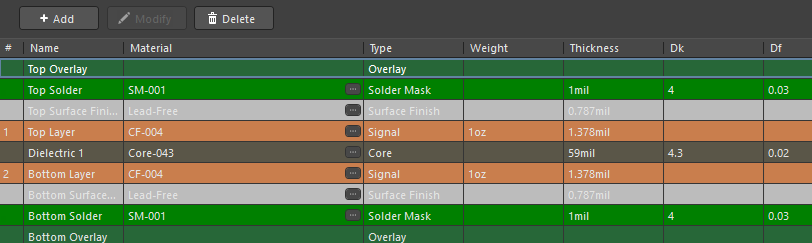
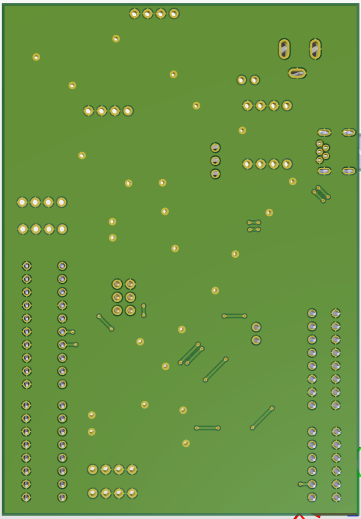
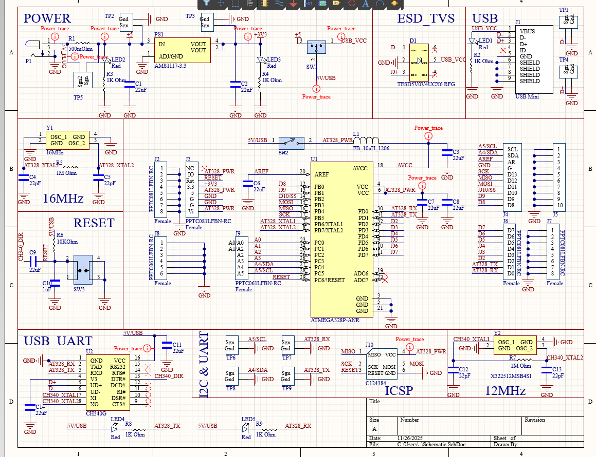

# Board 3 — Golden Arduino PCB (ECEN 5730)

This project is a fully custom-designed **Arduino-style microcontroller board**, created as part of the ECEN 5730 PCB Design coursework at CU Boulder.  

The board recreates the functionality of an Arduino-class MCU platform, including clock sources, USB-UART interface, I/O headers, power regulation, ESD protection, and debugging interfaces.  
It demonstrates a complete microcontroller subsystem design implemented from scratch.

---

## 🔍 Overview

### **Key Features**
- **ATmega328P-AU** microcontroller (same MCU used on Arduino Uno)  
- **16 MHz crystal oscillator** + proper loading caps  
- **12 MHz crystal for CH340 USB-UART interface**  
- **CH340G USB-UART bridge** for programming & serial comms  
- **ESD protection TVS diode array**  
- **5 V / 3.3 V regulation** using AMS1117-3.3  
- **USB Mini-B connector**  
- **Reset circuit** and power-on LED  
- **Headers for all GPIO pins** (J4–J10)  
- **SDA/SCL, ICSP headers** for full programming/debug access  
- **Extensive test points** for probing MCU buses and power rails  

### **Board Specs**
- 2-Layer PCB  
- 1 oz copper  
- 16 MHz & 12 MHz oscillators  
- USB data routing (D+/D-)  
- Mixed-signal design with MCU, oscillator, and USB subsystems  
- Designed for firmware loading and serial debugging  

---

# 🖼️ Image Gallery

## **1. Layer Stack**



---

## **2. 3D View — Top Side**


---

## **3. 3D View — Bottom Side**



---

## **4. Top Layer Routing**

A dense but controlled routing environment:

- Proper breakout of ATmega328P pins  
- Separation of USB signals, clock nets, and MCU GPIO  
- Local decoupling close to power pins  
- ICSP header and UART pins broken out for debugging  
- Thick power traces for robustness  


---

## **5. Schematic (PDF Version Included)**

Functional blocks include:

- **Power module** (USB VBUS → 5V → 3.3V LDO)  
- **USB protection & interface** (CH340G + TVS array)  
- **MCU core** (ATmega328, AVCC, AREF, decoupling)  
- **Reset circuit**  
- **16 MHz and 12 MHz crystal oscillators**  
- **GPIO Breakout Headers**  
- **ICSP programming interface**  



📄 Full schematic:  
[`schematic.pdf`](schematic.pdf)

---

# 📂 Design Files

```yaml
board_3_golden_arduino_pcb/
├── README.md
├── schematic.pdf
├── layout_files/
│ └── board_3_golden_arduino_pcb.zip
└── images/
├── layout_3d.png
├── layout_3d_bottom.png
├── layout_top.png
├── schematic.png
└── layer_stack.png
```

---

## 🎯 Skills Demonstrated

- Microcontroller system design (power, clocking, I/O)  
- USB-UART interface layout  
- Differential-pair-aware routing for USB D+/D−  
- Crystal oscillator layout & grounding  
- Decoupling placement strategy  
- Header mapping & board bring-up considerations  
- Schematic organization by functional blocks  
- Practical firmware loading (ICSP) & debugging access  

---

## 📝 Notes

This board was tested in-lab for:

- USB communication stability  
- Clock accuracy at both 12 MHz and 16 MHz  
- GPIO functionality  
- UART communication via CH340G  
- ICSP programming & reset circuit behavior  

---

This design forms **Board 3** in the ECEN 5730 PCB Portfolio, demonstrating a complete microcontroller subsystem engineered from first principles.

