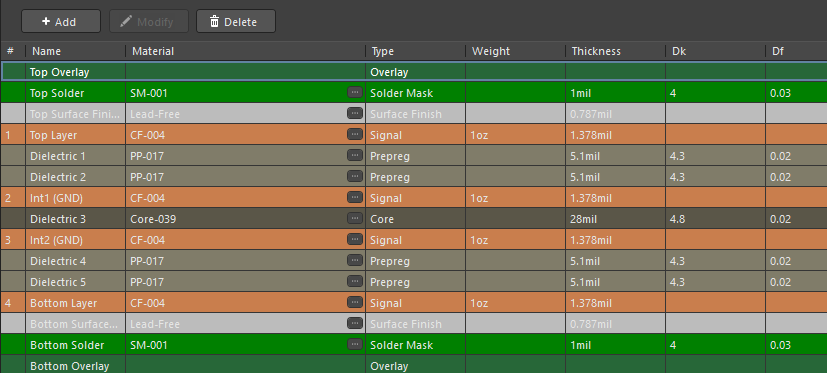
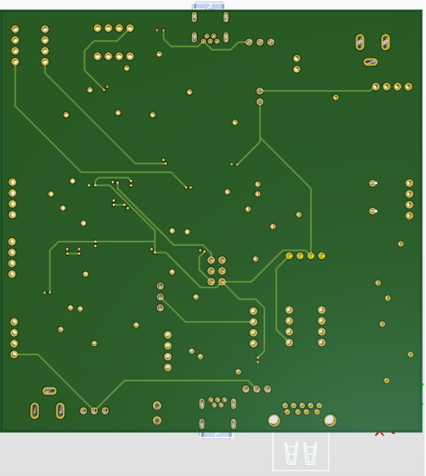
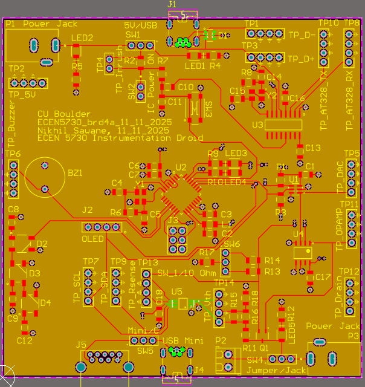
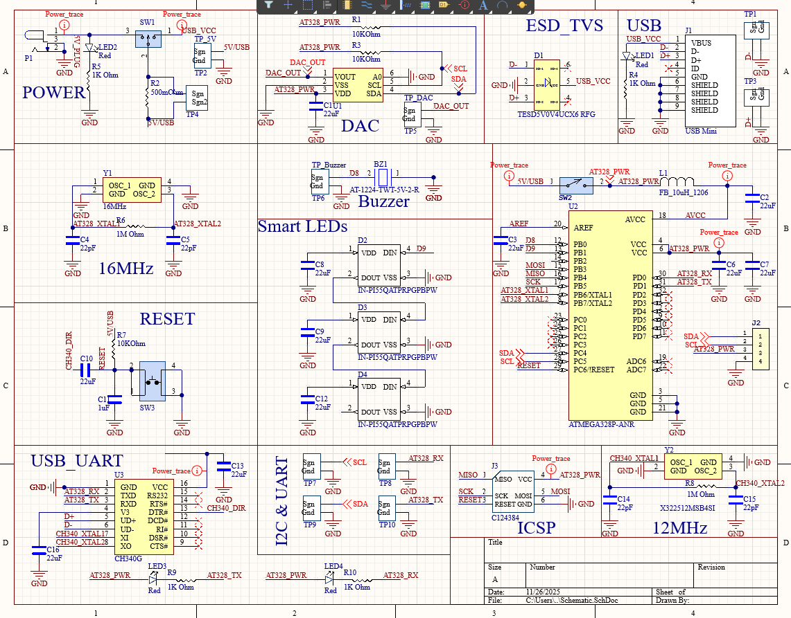

# Board 4 — Instrumentation Droid (ECEN 5730)

This project is a fully featured **instrumentation-focused mixed-signal board** designed as the capstone assignment for ECEN 5730 PCB Design at CU Boulder.  

The “Instrumentation Droid” integrates sensors, microcontroller interfaces, I2C peripherals, a DAC, smart LEDs, USB-UART communication, ESD protection, and a full set of labeled test points—allowing detailed signal measurement and debugging across the system.

This board demonstrates **advanced PCB layout**, **mixed-signal partitioning**, **multi-layer design**, and **system-level integration**.

---

## 🔍 Overview

### **Key Functional Blocks**
- **ATmega328P-AU Microcontroller**  
- **16 MHz oscillator** + proper grounding and loading caps  
- **USB-UART interface (CH340G)**  
- **DAC subsystem** with analog routing and separated returns  
- **Smart RGB LEDs** (IN-PI55QTRPGB series)  
- **Buzzer (Bz1)** with drive transistor  
- **OLED connector (J2)**  
- **I²C & UART headers**  
- **Comprehensive test points** (TP1–TP18) for debugging  
- **5V/USB power selection**  
- **ESD TVS protection array** for USB  
- **Multi-layer grounding for noise reduction**  

### **Board Specs**
- **4-layer PCB**  
- Signal — GND — GND — Signal stack  
- 1 oz copper  
- Mixed analog/digital layout  
- EMI-conscious routing  
- Multiple return-path stitching vias  

---

# 🖼️ Image Gallery

## **1. Layer Stack**

The 4-layer stack provides isolated, low-impedance ground planes under both digital and analog channels.



---

## **2. 3D View — Top Side**

Shows system integration: MCU core, DAC, USB, buzzer, OLED connector, RGB LEDs, crystal, switches, and organized test points.


---

## **3. 3D View — Bottom Side**

Bottom routing highlighting analog/digital segmentation and return path design.



---

## **4. Top Layer Copper View**

Routing highlights:

- Clean breakout routing from the ATmega328P  
- Smart LED serial routing pattern  
- DAC and analog nodes kept short and isolated  
- Ground stitching to reduce noise  
- USB power and data carefully routed  
- Clock nets kept tight and short  



---

## **5. Schematic (PDF Version Included)**

Functional blocks displayed:

- **Power module**  
- **DAC**  
- **Smart LEDs**  
- **Buzzer**  
- **Microcontroller subsystem**  
- **12 MHz + 16 MHz crystal oscillators**  
- **USB-UART interface**  
- **Reset circuit**  
- **I²C & UART buses**  
- **ICSP programming interface**  



Full PDF:  
📄 **[`schematic.pdf`](schematic.pdf)**

---

# 📂 Design Files

```yaml
board_4_instrumentation_droid/
├── README.md
├── schematic.pdf
├── layout_files/
│ └── board_4_instrumentation_droid.zip (source files)
└── images/
├── layer_stack.png
├── layout_3d.png
├── layout_3d_bottom.png
├── layout_top.png
└── schematic.png
```

---

## 🎯 Skills Demonstrated

- Professional **4-layer mixed-signal layout**  
- Ground/power plane planning for noise-sensitive circuits  
- DAC → analog routing with isolated return paths  
- Microcontroller subsystem integration (clocking, reset, I/O mapping)  
- Smart LED chain routing  
- USB-UART communication with ESD protection  
- Power domain management (USB vs external 5 V)  
- Test-point planning for detailed bring-up and measurement  
- Clean schematic organization by subsystem  
- High-quality documentation and labeling  

---

## 📝 Notes

This board was used in-lab to validate:

- DAC output performance and signal quality  
- I2C communication with OLED and sensors  
- USB serial communication stability  
- Smart LED chain behavior and timing  
- Buzzer drive waveform characteristics  
- Ground noise behavior across the 4-layer stack  

---

This design forms **Board 4** of the ECEN 5730 PCB Design Portfolio, demonstrating advanced multi-layer mixed-signal PCB engineering.

