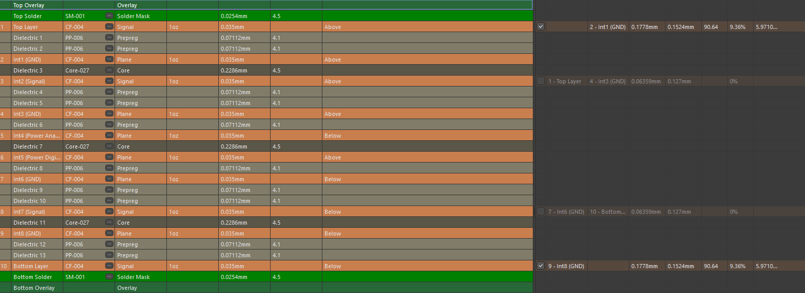
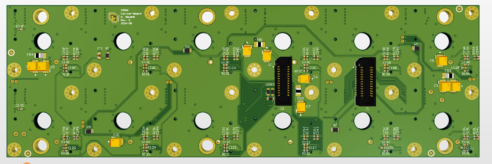
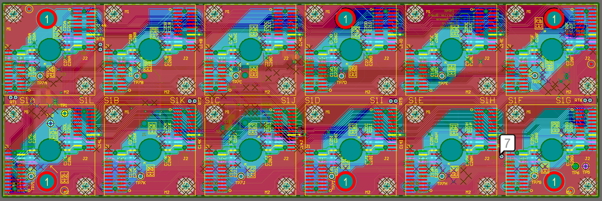
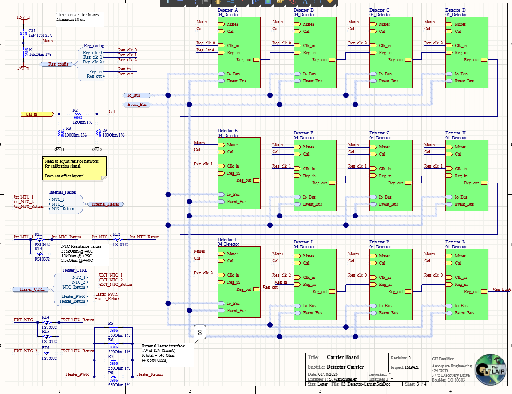

# IMPAX Carrier Board (10-Layer Detector Carrier Board)

This design is a **10-layer detector carrier board** developed for the **IMPAX payload electronics stack**. The board organizes a tiled detector interface architecture, routing detector signals, calibration lines, register configuration signals, event buses, housekeeping connections, heater control, and temperature-monitoring interfaces.

The images below highlight the **10-layer stack-up**, **top and bottom 3D board views**, **top-layer layout**, and a representative **schematic page** showing the detector carrier architecture.

All content is anonymized and intended purely as a PCB design portfolio example.

---

## 🔧 Board Overview

- **10-layer PCB stack-up** with multiple dedicated ground reference planes  
- Repeated detector-carrier layout structure for multiple detector channels  
- Detector interface blocks arranged in a tiled layout  
- Shared signal buses for:
  - Event signals  
  - I/O signals  
  - Register configuration  
  - Calibration  
- Daisy-chained register routing between detector blocks  
- Internal and external temperature-sensing interfaces  
- Heater-control and heater-power routing  
- Separate analog and digital power distribution layers  
- Board-to-board connector interfaces  
- Designed and laid out in **Altium Designer**

This board functions as a **detector carrier and interface board**, providing structured electrical connectivity between multiple detector modules and the rest of the IMPAX payload electronics system.

---

## 🛰️ Mission Context

**IMPAX** stands for **Imaging Microburst Precipitation with Atmospheric X-ray emissions**.

The mission studies relativistic electron microburst precipitation and associated atmospheric X-ray emissions. Within the payload electronics stack, this Carrier Board supports detector-level signal organization, calibration routing, housekeeping, and interface connectivity.

This repository presents a sanitized version of the board for engineering portfolio documentation.

---

## 🧱 Layer Stack Strategy (10 Layers)

The board uses a **10-layer PCB stack-up** designed to support repeated detector routing, clean return paths, and separation between analog, digital, power, and interface signals.

### Stack-up shown:

- **Top Layer:** Signal / component placement  
- **Internal Layer 1:** Ground plane  
- **Internal Layer 2:** Signal  
- **Internal Layer 3:** Ground plane  
- **Internal Layer 4:** Power / analog  
- **Internal Layer 5:** Power / digital  
- **Internal Layer 6:** Ground plane  
- **Internal Layer 7:** Signal  
- **Internal Layer 8:** Ground plane  
- **Bottom Layer:** Signal / component placement  

### Key stack features:

- Multiple solid **GND planes** for low-impedance signal return paths  
- Separate internal layers for analog and digital power distribution  
- Internal routing layers to support dense repeated detector connections  
- Symmetric signal and ground structure for layout robustness  
- Ground-referenced routing for detector, bus, and configuration signals  

This stack-up supports a dense repeated detector layout while keeping power distribution, signal routing, and return paths organized.



---

## 🖼️ Image Gallery

### 1. 3D Views

**Top-side 3D**  
Shows the repeated detector carrier layout, connector locations, detector interface regions, and mechanical organization of the tiled array.


**Bottom-side 3D**  
Highlights bottom-side support circuitry, board-to-board connectors, passive networks, and routing support for the detector carrier structure.



---

### 2. Top Layer Layout

Top copper view highlighting:

- Repeated detector interface cells arranged in a tiled pattern  
- Consistent routing structure across detector channels  
- Shared buses routed across the detector array  
- Connector fanout regions for each detector block  
- Local passive networks placed near detector interfaces  
- Ground-referenced routing across the full PCB  



---

## 🧩 Detector Carrier Architecture

The schematic page organizes the carrier into repeated detector interface blocks.

Representative detector blocks include:

- Detector A  
- Detector B  
- Detector C  
- Detector D  
- Detector E  
- Detector F  
- Detector G  
- Detector H  
- Detector I  
- Detector J  
- Detector K  
- Detector L  

Each detector block connects into shared system-level signals, including:

- **Mares signal**
- **Calibration signal**
- **Register clock**
- **Register input**
- **Register output**
- **I/O bus**
- **Event bus**

The register path is arranged in a chained structure, allowing configuration data to propagate through the detector blocks in an organized way.



---

## 🔌 Interface and Signal Organization

The Carrier Board is organized around repeated detector cells and shared board-level buses.

Representative signal groups include:

- **Detector interface signals**  
- **Mares timing/control signal**  
- **Calibration routing**  
- **Register configuration chain**  
- **Register clock distribution**  
- **I/O bus routing**  
- **Event bus routing**  
- **Internal NTC temperature sensing**  
- **External NTC temperature sensing**  
- **Heater control**  
- **Heater power and return**  

This structure allows the board to support multiple detector channels while keeping routing, review, and debugging manageable.

---

## 🌡️ Housekeeping, Heater, and Temperature Interfaces

The design includes support circuitry for detector-adjacent housekeeping and thermal control.

Key features include:

- Internal NTC temperature-sensing connections  
- External NTC temperature-sensing connections  
- Heater-control interface  
- Heater-power and heater-return routing  
- Local resistor and capacitor networks around detector interface regions  
- Calibration-related passive networks  

These features support detector operation, monitoring, and controlled thermal behavior at the board level.

---

## ⚡ Power, Grounding, and Signal Integrity Focus

Important design considerations included:

- Using multiple ground planes for stable return paths  
- Keeping repeated detector cells physically consistent  
- Separating analog and digital power distribution internally  
- Routing shared buses cleanly across the detector array  
- Maintaining consistent connector fanout strategy  
- Minimizing unnecessary routing variation between repeated channels  
- Supporting debugging through clear schematic hierarchy and signal naming  

The layout reflects a repeated-cell design approach where consistency, signal grouping, and grounding discipline are critical.

---

## 📁 Folder Contents

```text
IMPAX_Carrier_Board/
├─ README.md
└─ images/
   ├─ layer_stack.png
   ├─ layout_3d.png
   ├─ layout_3d_bottom.png
   ├─ layout_top.png
   └─ schematic.png
```

---

## 🧠 Design Focus & Takeaways

This board demonstrates:

10-layer stack-up planning for dense detector electronics
Repeated detector-cell placement and routing strategy
Shared bus routing across multiple detector interfaces
Register-chain organization across detector channels
Separation of analog and digital power domains
Temperature-sensing and heater-control integration
Connector-driven interface planning
Altium-based schematic, stack-up, and layout documentation

This project reflects my approach to detector-interface PCB design, where repeated layout structure, signal grouping, grounding, thermal interfaces, and documentation clarity are treated as core parts of the electrical architecture.

---

## ⚠️ Disclaimer

This repository contains a sanitized portfolio version of the IMPAX Carrier Board documentation. Sensitive mission details, complete manufacturing files, full schematics, BOM data, connector pinout details, and restricted design information are intentionally omitted.
---
