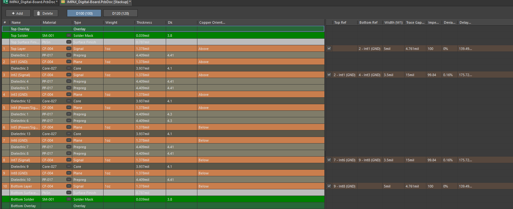
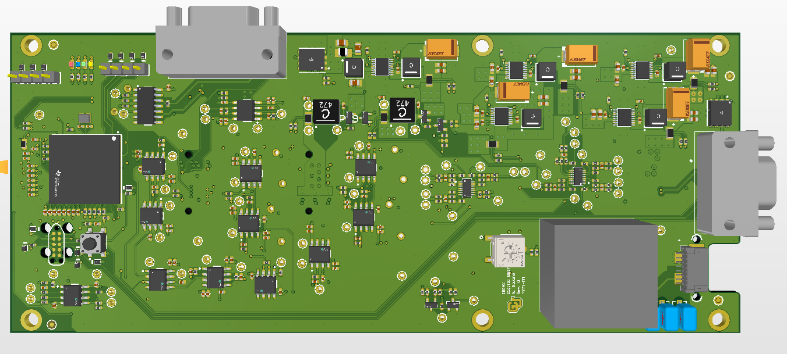
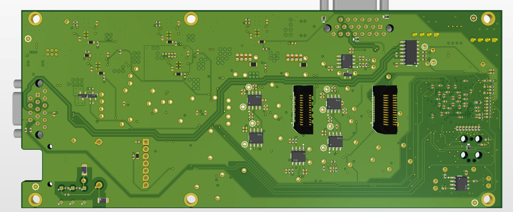
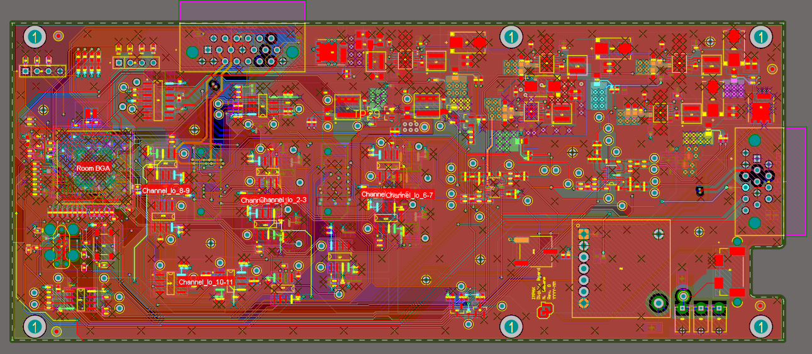
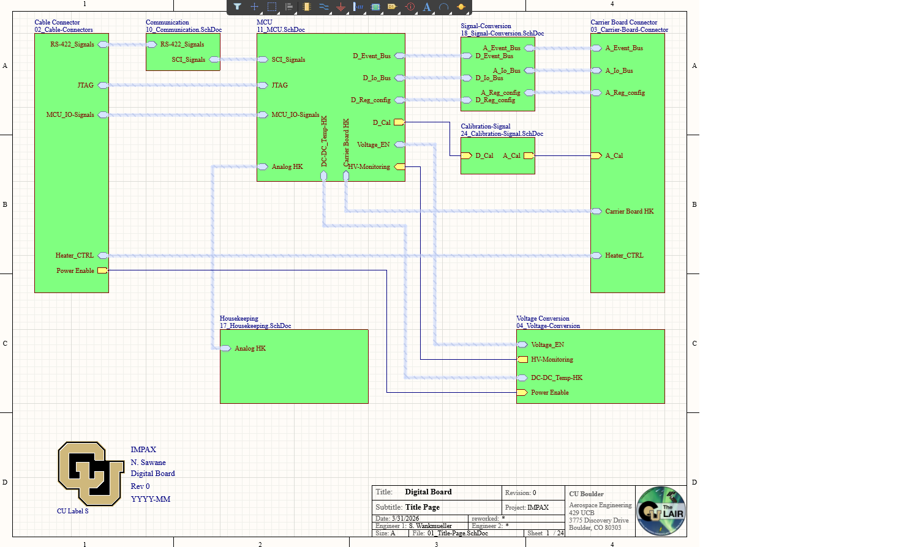

# IMPAX Digital Board (10-Layer Payload Digital Interface Board)

This design is a **10-layer digital electronics board** developed for the **IMPAX payload electronics stack**. The board supports digital communication, signal conversion, housekeeping interfaces, calibration routing, and carrier-board connectivity for the IMPAX instrument system.

The images below highlight the **10-layer stack-up**, **top and bottom 3D board views**, **top-layer layout**, and a representative **schematic top page** showing the overall digital board architecture.

All content is anonymized and intended purely as a PCB design portfolio example.

---

## 🔧 Board Overview

- **10-layer PCB stack-up** with multiple dedicated ground reference planes  
- Central **MCU-based digital control architecture**  
- Digital communication interfaces including:
  - RS-422 signals  
  - SCI signals  
  - JTAG  
  - MCU I/O signals  
- Signal conversion between digital-board and carrier-board domains  
- Carrier-board connector interface for event, I/O, register configuration, housekeeping, heater control, and calibration signals  
- On-board housekeeping interfaces for analog monitoring, DC-DC temperature monitoring, and high-voltage monitoring  
- Voltage conversion and enable-control circuitry  
- Multiple board-to-board and cable connector interfaces  
- Designed and laid out in **Altium Designer**

This board functions as a **payload digital interface and control board**, organizing communication between the cable interface, MCU, signal-conversion circuitry, housekeeping blocks, voltage-conversion circuitry, and carrier-board interface.

---

## 🛰️ Mission Context

**IMPAX** stands for **Imaging Microburst Precipitation with Atmospheric X-ray emissions**.

The mission studies relativistic electron microburst precipitation and associated atmospheric X-ray emissions. Within the payload electronics stack, this Digital Board supports the organization, routing, and control of digital and mixed-interface signals required by the instrument electronics.

This repository presents a sanitized version of the board for engineering portfolio documentation.

---

## 🧱 Layer Stack Strategy (10 Layers)

The board uses a **10-layer PCB stack-up** designed to support dense digital routing, controlled return paths, and clean separation between signal, ground, and power domains.

### Stack-up shown:

- **Top Layer:** Signal / component placement  
- **Internal Layer 1:** Ground plane  
- **Internal Layer 2:** Signal  
- **Internal Layer 3:** Ground plane  
- **Internal Layer 4:** Power / signal plane  
- **Internal Layer 5:** Power / signal plane  
- **Internal Layer 6:** Ground plane  
- **Internal Layer 7:** Signal  
- **Internal Layer 8:** Ground plane  
- **Bottom Layer:** Signal / component placement  

### Key stack features:

- Multiple solid **GND planes** for low-impedance return paths  
- Internal routing layers for dense digital and interface signals  
- Internal power/signal layers for payload power distribution and routing flexibility  
- Controlled-impedance routing profiles used for high-speed or differential interfaces  
- Symmetric signal/ground structure to improve signal integrity and layout robustness  

This stack-up supports the board’s role as a dense payload digital interface board while maintaining clean return paths and manageable routing density.



---

## 🖼️ Image Gallery

### 1. 3D Views

**Top-side 3D**  
Shows the primary component placement, MCU area, connector interfaces, voltage-conversion circuitry, and dense top-side routing organization.



**Bottom-side 3D**  
Highlights bottom-side component placement, secondary routing regions, connector support circuitry, and additional board-to-board interface areas.



---

### 2. Top Layer Layout

Top copper view highlighting:

- Functional placement rooms for MCU, BGA/interface regions, and channel groups  
- Connector-driven signal routing across the board  
- Dense routing between digital interface blocks  
- Ground-referenced routing strategy across the full PCB  
- Via transitions between top-layer routing and internal signal layers  
- Localized routing around signal-conversion and housekeeping circuitry  



---

## 🧩 Digital Board Architecture

The schematic top page organizes the design into major functional blocks:

- **Cable Connector**  
  External cable interface carrying RS-422, JTAG, MCU I/O, heater control, and power-enable signals.

- **Communication**  
  Interface circuitry for RS-422 and SCI communication signals.

- **MCU**  
  Central digital control section handling I/O, event bus, register configuration, calibration control, housekeeping, voltage enable, and monitoring signals.

- **Signal Conversion**  
  Converts or routes digital-board signals into carrier-board signal domains, including event bus, I/O bus, and register configuration paths.

- **Calibration Signal**  
  Routes calibration control between digital and carrier-board domains.

- **Voltage Conversion**  
  Includes enable control, DC-DC temperature housekeeping, high-voltage monitoring, and power-enable related signals.

- **Housekeeping**  
  Supports analog housekeeping signals used for system health monitoring.

- **Carrier Board Connector**  
  Main interface to the downstream carrier board, including event signals, I/O bus, register configuration, calibration, housekeeping, and heater-control connections.



---

## 🔌 Interface and Signal Organization

The Digital Board is organized around clear signal grouping between the cable connector, MCU, signal-conversion blocks, and carrier-board connector.

Representative signal groups include:

- **RS-422 communication signals**  
- **SCI communication signals**  
- **JTAG programming/debug interface**  
- **MCU I/O signals**  
- **Digital and analog event buses**  
- **Digital and analog I/O buses**  
- **Register configuration signals**  
- **Calibration signals**  
- **Analog housekeeping signals**  
- **Carrier-board housekeeping signals**  
- **Voltage enable and power-enable signals**  
- **High-voltage monitoring signals**  
- **Heater-control signals**

This structure makes the schematic easier to review and helps keep the PCB layout organized around real system-level interfaces.

---

## ⚡ Power, Grounding, and Signal Integrity Focus

Important design considerations included:

- Using dedicated ground planes to provide strong signal return paths  
- Keeping routed digital signals referenced to nearby ground layers  
- Using internal layers to reduce routing congestion on the outer layers  
- Maintaining organized connector fanout regions  
- Separating functional areas to improve readability and debugging  
- Supporting controlled-impedance routing where required  
- Using via stitching and ground referencing to improve board-level robustness  

The layout reflects a system-level approach where routing, grounding, connector placement, and functional partitioning are treated together.

---

## 📁 Folder Contents

```text
IMPAX_Digital_Board/
├─ README.md
└─ images/
   ├─ layer_stack.png
   ├─ layout_3d.png
   ├─ layout_3d_bottom.png
   ├─ layout_top.png
   └─ schematic.png

---

## 🧠 Design Focus & Takeaways

This board demonstrates:

Multi-layer PCB planning for payload digital electronics
Connector-focused digital interface design
Clean schematic organization for collaborative review
Ground-referenced routing for digital signal integrity
Layout planning for compact CubeSat payload electronics
Altium-based documentation and portfolio presentation

This project reflects my approach to digital PCB design, where schematic clarity, connector organization, grounding strategy, and layout discipline are treated as important parts of the overall electronics architecture.

---

## ⚠️ Disclaimer

This repository contains a sanitized portfolio version of the IMPAX Digital Board documentation. Sensitive mission details, complete manufacturing files, full schematics, BOM data, and restricted design information are intentionally omitted.