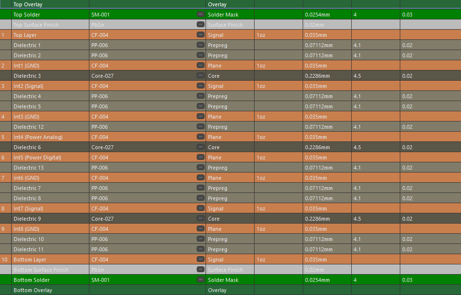
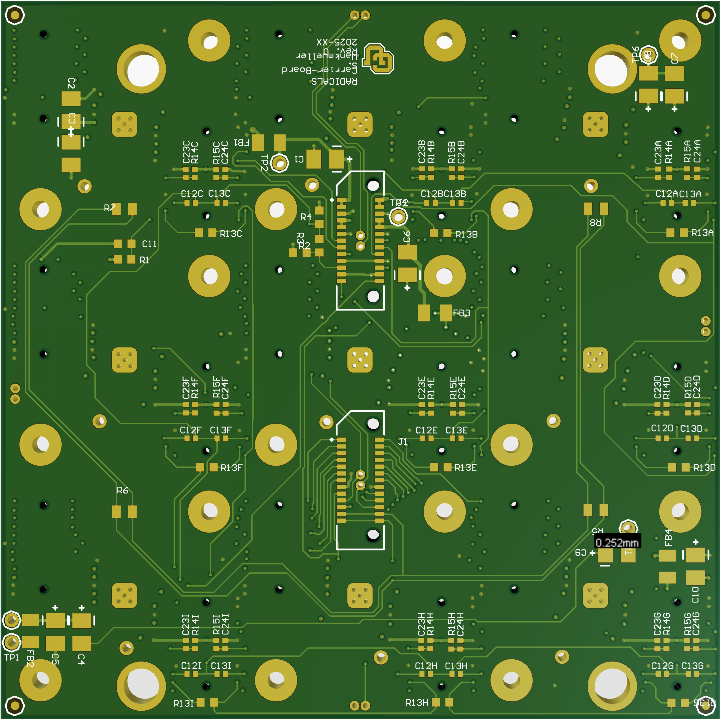
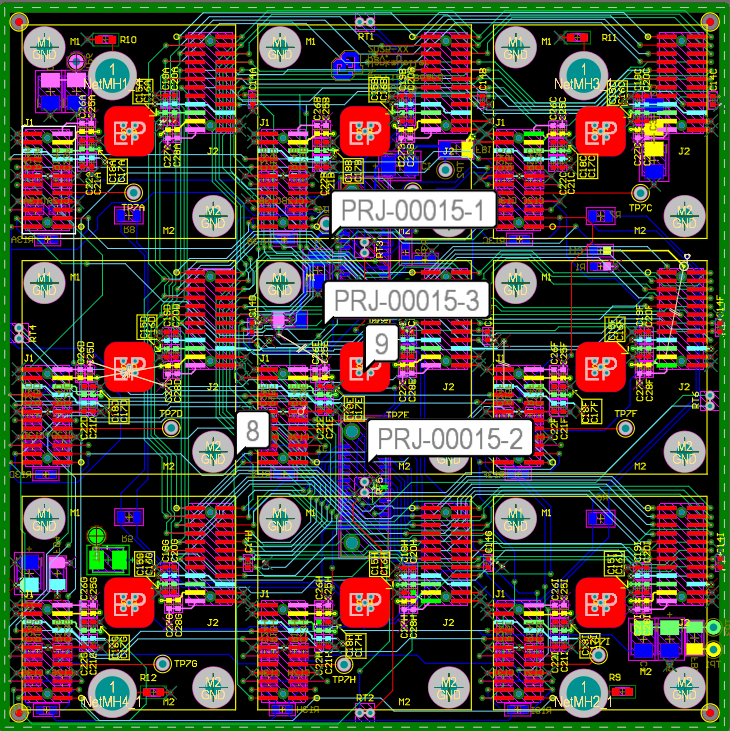

# Carrier Board (10-Layer Detector Carrier)

This design is a **10-layer detector carrier board** used to interface and distribute power, clocks, configuration, and data across a tiled array of identical detector modules.

The images below highlight the **10-layer stack-up**, **3D views**, **routing density**, and a representative **schematic page** illustrating the daisy-chained detector architecture.

All content is anonymized and intended purely as a PCB design portfolio example.

---

## 🔧 Board Overview

- **10-layer PCB stack-up** with dedicated signal, power, and ground planes  
- Tiled array of **9 identical detector sub-circuits**  
- Daisy-chained clock, configuration, and data buses  
- Separate **analog and digital power domains**  
- Heavy use of **internal-layer routing** to reduce surface congestion  
- Via-adjacent pad fanout strategy for dense connector interfaces  
- Designed and laid out in **Altium Designer**

This board functions as a **system-level carrier**, distributing regulated power, clocks, and control signals from upstream electronics to multiple detectors with tight electrical symmetry.

---

## 🧱 Layer Stack Strategy (10 Layers)

The 10-layer stack is intentionally structured to support:

- High routing density without top-layer congestion  
- Clean return paths using multiple solid ground planes  
- Isolation between analog and digital power domains  
- Predictable signal integrity across daisy-chained detectors  

### Key stack features:

- Multiple dedicated **GND planes** for shielding and low-impedance return paths  
- Separate internal **analog power plane** and **digital power plane**  
- Multiple internal **signal layers** for clock, configuration, and data routing  
- Surface layers primarily used for component placement and short local routes  

This structure enables each detector tile to behave electrically consistent across the board.



---

## 🖼️ Image Gallery

### 1. 3D Views

**Top-side 3D**  
Shows tiled detector placement, connector symmetry, local decoupling, and mechanical mounting features.


**Bottom-side 3D**  
Highlights via fields, internal routing transitions, and bottom-side support circuitry.



---

### 2. Top Layer Layout

Top copper view highlighting:

- Repeated detector tiles with identical placement  
- Connector fanout regions  
- Local decoupling near each detector  
- Minimal long surface routing (signals escape quickly to inner layers)  



---

### 3. Internal Routing Strategy

Although routing is not shown explicitly in screenshots, the layout is dominated by **inner-layer signal routing**:

- Clock and configuration buses routed symmetrically on internal signal layers  
- Power distributed primarily through dedicated internal planes  
- Short surface traces used mainly for pad escape and local connections  

This approach improves signal integrity and keeps the layout scalable as detector count increases.

---

### 4. Schematic Snapshot

Representative schematic page showing:

- Daisy-chained detector architecture  
- Shared clock and configuration buses  
- Separate analog and digital power rails  
- Modular detector block reuse  


---

## 📁 Folder Contents

```text
RADICALS_Carrier_Board/
├─ README.md
└─ images/
   ├─ layer_stack.png
   ├─ layout_3d.png
   ├─ layout_3d_bottom.png
   ├─ layout_top.png
   └─ schematic.png
```

---

## 🧠 Design Focus & Takeaways

This board demonstrates:
- 10-layer stack-up planning for mixed-signal systems
- Scalable tiled layout design using repeated detector sub-cystems
- Clear analog vs digital power separation
- Inner-layer routing discipline for dense, connector-heavy designs
- System-level carrier board design, not just isolated circuits

This project reflects my approach to complex instrumentation carrier boards where signal integrity, symmetry, and manufacturability are treated as first-order design constraints.

---