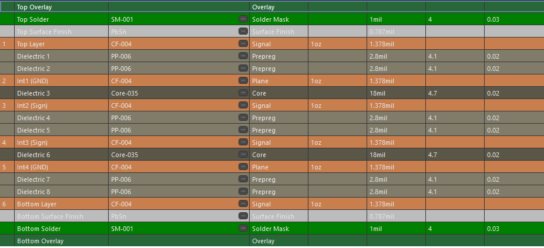
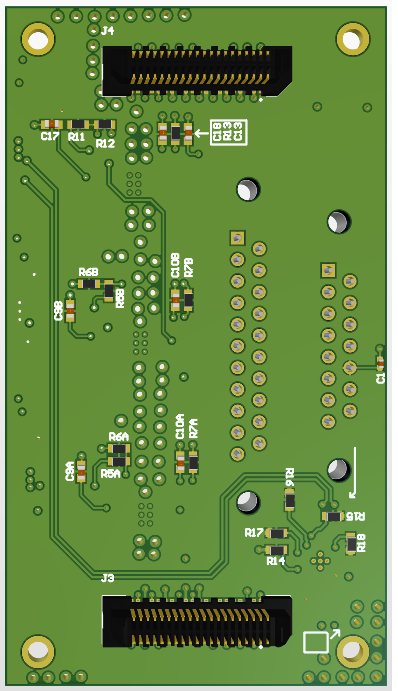
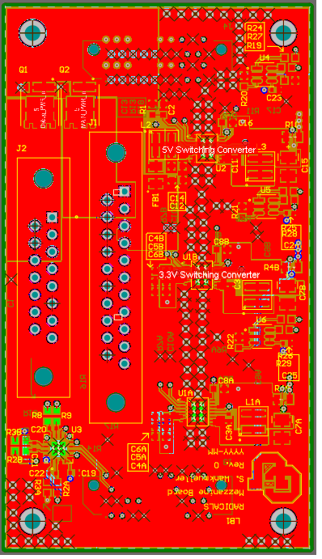
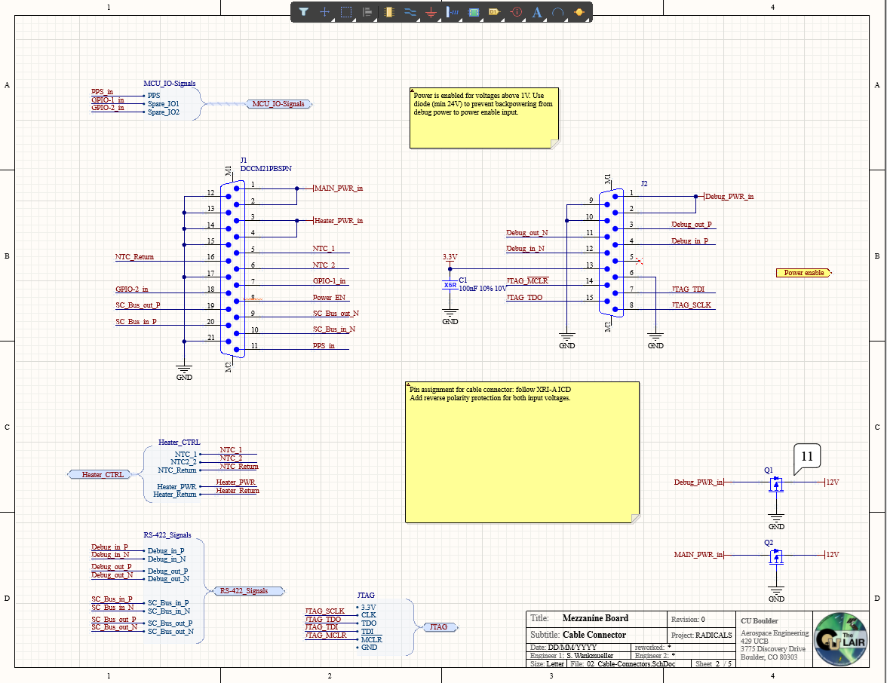

# Mezzanine Board (6-Layer Power & Housekeeping Board)

This design is a **6-layer mezzanine board** that sits between the system carrier and downstream electronics, providing **power regulation, housekeeping telemetry, and debug access** for the RADICALS electronics stack.

The images below highlight the **6-layer stack-up**, **3D views**, **converter-centric placement**, and a representative **schematic page** showing the power and monitoring architecture.

All content is anonymized and intended purely as a PCB design portfolio example.

---

## 🔧 Board Overview

- **6-layer PCB stack-up** with dual solid ground planes  
- On-board **DC-DC switching converters** generating:
  - 5 V  
  - 3.3 V  
  - 1.2 V  
- Dedicated **housekeeping subsystem** for health monitoring  
- Per-rail **current sensing** using I²C current monitors  
- Distributed **temperature sensing** near each power converter  
- Separate **main power** and **debug power** inputs with protection  
- Board-to-board and cable connector interfaces  
- Designed and laid out in **Altium Designer**

This board functions as a **power-conditioning and telemetry mezzanine**, bridging raw system power to regulated rails while continuously monitoring electrical and thermal health.

---

## 🧱 Layer Stack Strategy (6 Layers)

The 6-layer stack is intentionally structured to support:

- Low-noise switching regulator operation  
- Clean analog measurements for current and temperature sensing  
- Controlled return paths for high di/dt power loops  
- Clear separation between power, monitoring, and interface routing  

### Key stack features:

- **Top & bottom signal layers** for placement and short local routing  
- Two dedicated **solid GND planes** for shielding and low-impedance returns  
- Internal signal layers used for control, monitoring, and interconnect routing  
- Power distribution kept compact and localized around each converter  

This structure balances power integrity and measurement accuracy while keeping the layout compact and manufacturable.



---

## 🖼️ Image Gallery

### 1. 3D Views

**Top-side 3D**  
Shows the placement of switching converters, inductors, current monitors, temperature sensors, and connector interfaces.


**Bottom-side 3D**  
Highlights ground referencing, via stitching, and bottom-side routing supporting the power and monitoring subsystems.



---

### 2. Top Layer Layout

Top copper view highlighting:

- Converter-centric placement “rooms” for each voltage rail  
- Tight high-current loops around each switching regulator  
- Local decoupling and filtering components placed close to ICs  
- Clear physical separation between different voltage domains  



---

### 3. Power & Monitoring Architecture

The board integrates **active monitoring** alongside power generation:

- **Switching converters** generate 5 V, 3.3 V, and 1.2 V from a 12 V input  
- **Current monitors** measure load current on each rail over a shared I²C bus  
- **Temperature sensors** are placed near each converter to track local thermal behavior  
- A centralized **housekeeping I²C bus** aggregates telemetry for the host system  

This approach allows real-time insight into both electrical and thermal operating conditions.

---

### 4. Schematic Snapshot

Representative schematic page showing:

- Switching regulator topology and feedback networks  
- Current monitoring connections  
- Temperature sensor addressing and placement intent  
- Power enable and power-good signaling  



---

## 📁 Folder Contents

```text
RADICALS_Mezzanine_Board/
├─ README.md
└─ images/
   ├─ layer_stack.png
   ├─ layout_3d.png
   ├─ layout_3d_bottom.png
   ├─ layout_top.png
   └─ schematic.png
```

## 🧠 Design Focus & Takeaways

This board demonstrates:
- 6-layer stack-up planning for mixed power and measurement systems
- Switching regulator layout with controlled current loops
- Practical integration of current and temperature telemetry
- Physical placement strategies to balance EMI, thermals, and routing
- Design of a mezzanine board that complements, rather than duplicates, a system carrier

This project reflects my approach to power-aware system design, where regulation, monitoring, and layout discipline are treated as equally important parts of the architecture.