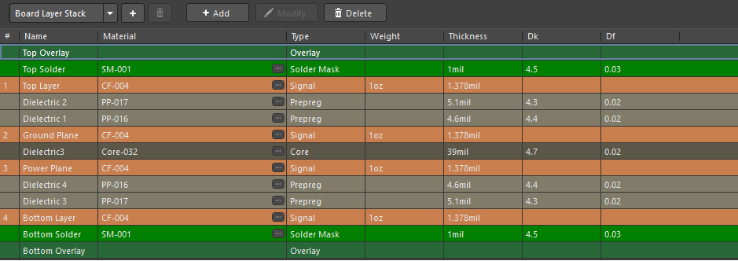
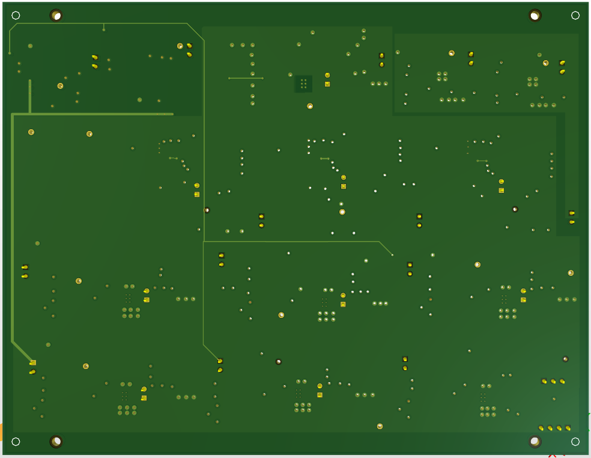
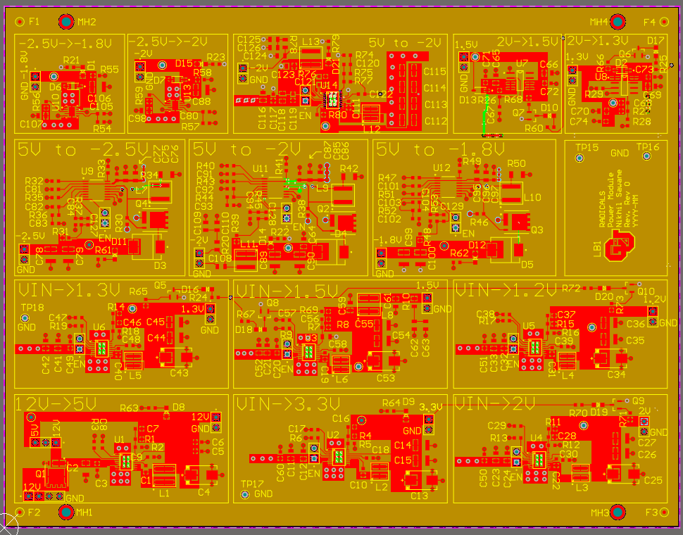
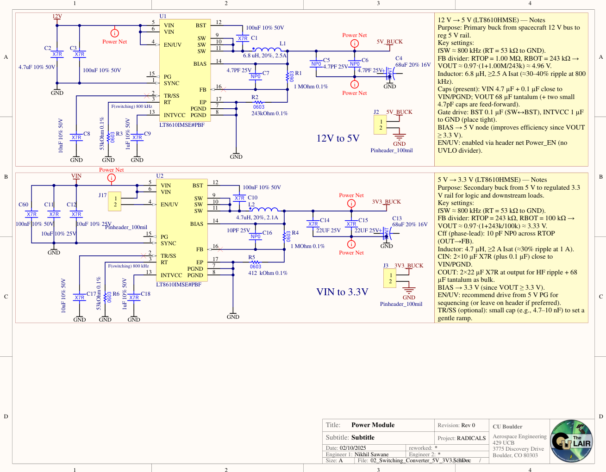

# Power Board (4-Layer)

This design is a 4-layer multi-voltage power board.  
Screenshots below highlight the **stack-up**, **3D views**, **routing**, and a sample **schematic page**.

All content is anonymized and intended purely as a PCB design portfolio example.

---

## 🔧 Board Overview

- 4-layer stack with internal planes
- Multiple DC-DC and LDO stages
- Segmented regions for each rail
- Compact placement and short switching loops
- Designed and laid out in Altium Designer

---

## 🖼️ Image Gallery

### 1. Layer Stack

Shows the dielectric structure, copper weights, and overall 4-layer configuration.



---

### 2. 3D Views

Top-side 3D: placement, decoupling strategy, and regional grouping of power stages.


Bottom-side 3D: via fields, stitching, and plane transitions.



---

### 3. Top Layer Routing

Top copper view highlighting:

- Short high-current paths  
- Local decoupling around converters  
- Segregated regions for different rails  



---

### 4. Schematic Snapshot

Representative schematic page for one of the buck converter stages:

- Input filtering and protection
- Switching regulator with feedback network
- Notes documenting design choices and key parameters



---

## 📁 Folder Contents

```text
power-board_4layer/
├─ README.md
└─ images/
   ├─ layer_stack.png
   ├─ layout_3d.png
   ├─ layout_3d_bottom.png
   ├─ layout_top.png
   └─ schematic.png
This folder is meant to visually demonstrate my PCB design style and layout approach for multi-rail power boards.
```
