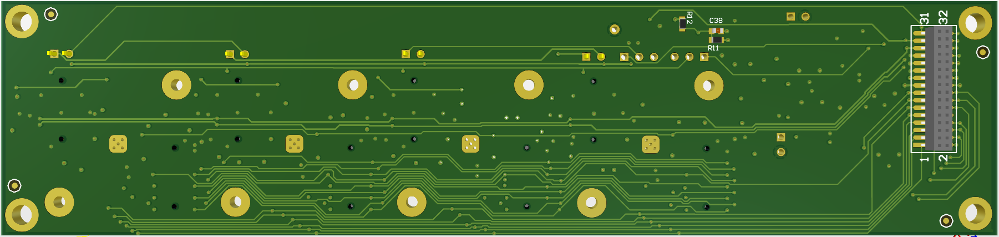
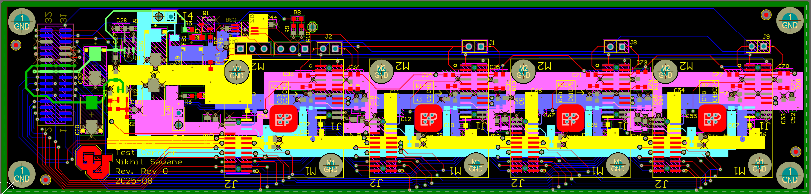
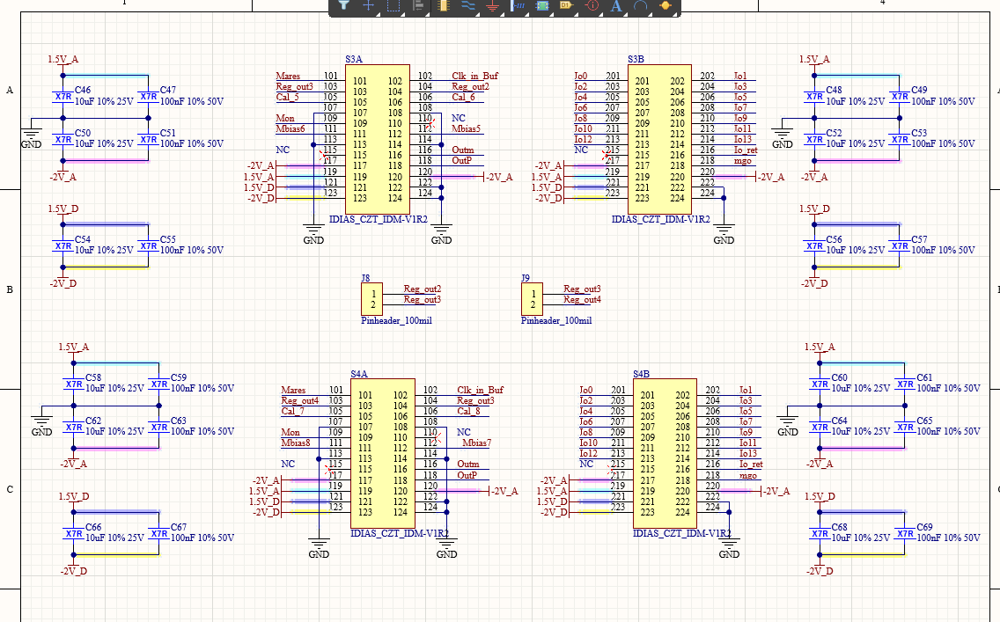
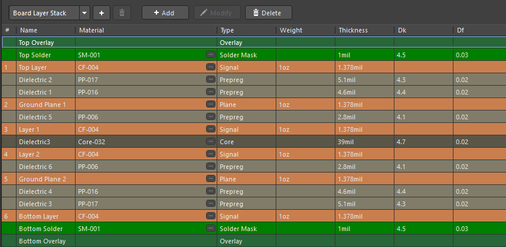

# Test / Characterization Carrier Board — PCB Design Showcase

This folder presents a **multi-layer test carrier board** designed to host multiple identical modules and route their signals to system connectors in a clean, repeatable, and signal-integrity-aware way.

All content is anonymized and included purely as a demonstration of PCB layout, routing strategy, and mixed-signal design capability.

---

## 🔍 Overview

This board provides a structured, repeatable interface for several device-under-test (DUT) modules.  
Its design focuses on:

- Consistent replicated module blocks  
- Clean breakout routing from high-density connectors  
- Controlled return-path behavior using internal planes  
- Stable power distribution with local decoupling  
- Mechanical constraints and proper mounting hole alignment  
- Lab-friendly accessibility for probing and characterization  

---

## 🛠️ Skills Demonstrated

### **Multi-Layer PCB Layout**
- Use of ground and power planes for stable reference and low-impedance return paths  
- Routing channels evenly distributed across the board  
- Layer transitions managed with stitching vias to preserve signal quality  

### **Repeated Channel Design**
- Four identical module sections laid out symmetrically  
- Copy-structured routing for consistent electrical behavior  
- Matched trace lengths and spacing within each module region  

### **Mixed-Signal Practices**
- Separation of analog/digital return currents  
- Local decoupling at each module  
- Crosstalk-aware parallel routing along the bottom layer  

### **Connector and Harness Integration**
- Clean, intuitive I/O connector placement  
- Sharp routing emerging from fine-pitch connectors  
- Proper labeling and silkscreen markings for lab use  

---

## 🖼️ Image Gallery

### **1. 3D View — Top Side**
Full board, showing replicated module footprints, decoupling capacitors, interface connectors, and overall placement strategy.


---

### **2. 3D View — Bottom Side**
Underside routing, showcasing return paths, via stitching, and clean horizontal bus routing.



---

### **3. Top Layer Routing**
Highlights:

- Symmetrical routing across all module channels  
- Clean breakout from high-density connectors  
- Use of polygons, planes, and routing channels  
- Well-defined module boundaries  



---

### **4. Schematic Snapshot**
Representative schematic page showing:

- Repeated module pin maps  
- Local bypass/decoupling networks  
- Power rails distributed across analog/digital domains  
- Clean, consistent annotation format  



---

### **5. Layer Stack**
Board stack-up used for routing and reference planes.



---

## 📁 Folder Contents

```text
test-carrier_board/
├── README.md
└── images/
    ├── layer_stack.png
    ├── layout_3d.png
    ├── layout_3d_bottom.png
    ├── layout_top.png
    └── schematic.png
